# Architecture

Current state: Phases 0 through 6 are verified. The local CLI downloads ten official documents, parses and redacts them, and stores 530 chunks with real Azure embeddings in Floci RDS using a 1536-dimension HNSW index. An unchanged repeat made zero provider requests. Infrastructure probes verified S3, Terraform/Terragrunt, Lambda SQL connectivity, and restart persistence. The CLI also retrieves public evidence and produces cited answers using real Azure chat inference, with weak-evidence and unsupported-question refusals. See [Phase 0 evidence](phase-0-results.md), [Phase 1 evidence](phase-1-results.md), [Phase 2 evidence](phase-2-results.md), [Phase 3 evidence](phase-3-results.md), [Phase 4 evidence](phase-4-results.md), [Phase 5 evidence](phase-5-results.md), and [Phase 6 evidence](phase-6-results.md).

The diagram shows the implemented application flow and planned monitoring. Terraform now deploys the S3, Step Functions, Lambda, API Gateway, IAM, log-group, and RDS wiring in dev and prod-style local environments. Container-image Lambda handlers now ingest a representative public document and answer queries through the REST API in both environments. The full CLI corpus remains separate. CloudWatch custom metrics and alarms remain Phase 7.

```mermaid
flowchart LR
    Sources[Public OSFI, FINTRAC, OPC documents] --> S3
    S3 --> SF[Step Functions]
    SF --> Parse[Parse Lambda]
    Parse --> Chunk[Chunk Lambda]
    Chunk --> Embed[Embed Lambda]
    Embed --> Privacy[PII redaction boundary]
    Privacy --> EB[Embedding backend: Azure / Ollama / Bedrock]
    EB --> PG[(pgvector on Floci RDS)]
    User[CLI or API client] --> API[API Gateway]
    API --> Query[Query Lambda]
    Query --> Safety[PII redaction and injection checks]
    Safety --> PG
    PG --> Context[Public source chunks and citation metadata]
    Context --> Chat[Chat backend: Azure / Ollama / Bedrock]
    Chat --> Output[Output checks and source citations]
    Output --> User
    Query --> CW[CloudWatch: redacted logs, metrics, alarms]
    SF --> CW
```

## AWS emulation and infrastructure

All AWS resources run on Floci in Docker, not a real AWS account. Floci exposes AWS APIs on a configurable endpoint, conventionally port 4566. Docker socket access lets it start real Lambda and database containers. The Compose service hostname and shared network make child-container endpoints reachable. Terraform uses the standard AWS provider, explicit service endpoints, and dummy local credentials; Terragrunt wraps it. Phase 0 uses local state. The shared platform module now provisions 33 resources per environment, with separate local state outside Terragrunt caches. Resource names have one owner in platform/main.tf locals. Dev and prod are both local environments, with separate raw/intermediate buckets, four Lambdas, an ingestion workflow, REST query API, scoped IAM roles, logs, and Docker-backed RDS instances. Each application database contains five real Azure-embedded representative chunks in configured-dimension vector tables; the existing CLI corpus remains on its original database.

Hybrid Floci storage retains resource metadata, with named volumes for RDS data. The restart probe preserved the S3 object and both vector rows. The RDS image override selects pgvector/pgvector:pg16, a Docker Hub tag published for ARM64 and AMD64. Its measured extension version is 0.8.7; the image digest is recorded in phase-0-results.md. Phase 0 uses synthetic vectors with the configured dimension and an HNSW cosine index. It does not call an embedding provider. Lambda SQL connectivity was verified through the advertised Floci RDS proxy endpoint on the shared Docker network.

## Chat and embedding switches

LLM_BACKEND and EMBEDDING_BACKEND each accept azure, ollama, or bedrock. The chat code default is bedrock. The Mac .env.example selects Azure for both. Windows instructions select Ollama for both, with a reachable OLLAMA_BASE_URL and model-specific dimension.

Azure chat uses openai.AzureOpenAI, separate system and user messages, the configured deployment as model, and max_completion_tokens. Requests omit temperature, top_p, penalties, logprobs, and max_tokens to avoid GPT-5 variant compatibility differences. The configured 2024-12-01-preview API version worked with the actual gpt-5.4-mini-2026-03-17 deployment. Requests have no hidden retries or automatic parameter fallbacks. Completion usage includes any reasoning tokens.

Azure embeddings use a separate AzureOpenAI client with the shared endpoint/key and embedding-specific deployment/API version. Inputs are redacted and sent in batches of 16; SDK retries are disabled. The initial deployment is text-embedding-3-small, with configured dimension 1536. Every row stores backend, model identity, dimension, and content hash. Table identity must match the query backend/model/dimension; mismatches refuse with re-ingestion instructions. Switching backends never mixes vectors in one index.

Ollama uses qwen3:8b chat and embeddinggemma:300m embeddings as configurable offline choices. The latter's dimension must match the actual returned vectors. Bedrock chat uses boto3 Converse; embeddings use Titan v2 InvokeModel requests, verified with boto3 Stubber. Floci Bedrock Runtime returns canned responses and cannot demonstrate real inference. All three embedding adapters are implemented. Azure embeddings were exercised live; Ollama embeddings are transport-mocked and Bedrock embeddings are mock-tested only. All three chat adapters are also implemented. Azure chat was exercised live; Ollama chat is transport-mocked and Bedrock Converse is mock-tested only.

## Ingestion and query

Phase 1 downloads ten public official documents with source URLs, retrieval dates, and hashes. HTML sections and PDF pages are split using LangChain with a 1500-byte budget and 200-byte overlap, preserving regulator, title, section, page/anchor, and URL. The redacted embedding input is bounded to 1900 bytes. Unchanged content hashes reuse vectors only within the same embedding identity. Transactional document replacement removes stale chunks; a successful run also removes documents dropped from the manifest. Table identity includes backend, deployment, dimension, endpoint/API, and privacy/prompt policy. Provider-reported model drift is refused. S3 now holds verified raw documents and parsed/chunk artifacts. A local uploader explicitly starts Step Functions; stages pass document/run identifiers that resolve to deterministic artifact keys. Shared persistence implements hash reuse for both CLI and Lambda. Single-document Lambda runs preserve other documents.

The ask CLI redacts the question and asserts index identity before any embedding call. Query embeddings use the same model as the index; Ollama uses the documented search-query prefix without changing document-vector identity. Cosine search returns up to RETRIEVAL_TOP_K manifest-listed documents, with a configurable RETRIEVAL_MIN_SIMILARITY gate. Source URL, regulator, and title must match the manifest.

LangChain Documents, ChatPromptTemplate, and RunnableLambda connect retrieval and generation; SQL persistence remains explicit. Numbered public excerpts are JSON data in the user message, separate from system instructions. ChatBackend redacts both messages at the provider boundary. The model returns supported/claims JSON, and rag.py validates structure and source numbers, redacts claim text, and builds URLs from trusted metadata, including existing anchors or PDF page fragments. Weak evidence skips chat; unsupported, malformed, filtered, or truncated responses produce explicit refusals. Citation validation does not establish semantic correctness or complete attack resistance. API Gateway invokes the real query handler; request validation, safety checks, cited answers, abstention, and safe usage journals were verified through HTTP in Phase 6.

## Privacy, cost, safety, and monitoring

No text goes to Azure before PII redaction. Only manifest-listed public regulatory documents become context. Phase 1 implements a local Presidio/spaCy redaction boundary before every embedding request. Phase 2 also redacts questions, chat messages, and generated claim text. Detector limits and false-positive counts are recorded in phase-1-results.md; Phase 3 adds a separately versioned query policy for normalization, labelled DOB/account/address values, simple obfuscated emails, and postal codes without changing document embeddings. The local fixture assessment and known misses are recorded in phase-3-results.md. Retrieved text remains untrusted. Normalized input injection checks refuse before provider calls; suspicious source text/titles/headings refuse before chat. Generated claims with detected PII, injection phrases, or dangerous markup/link schemes are withheld. Citation display fields are redacted and detected-sensitive anchors removed. Excerpt fields are redacted before JSON serialization, and query tracing is disabled even inside a parent tracing context. The measured pattern misses and false positives prevent claims of complete protection.

Ingestion batches embeddings, caps new batches, and journals reported token usage and requests with unknown usage. Chat adapters enforce LLM_MAX_OUTPUT_TOKENS (initially 2048). Query journals record provider model, reported input/output tokens, unknown usage, question/prompt hashes, index/manifest identity, and refusals; raw questions, prompts, and provider error bodies are not journaled. The eval CLI validates exact public gold references before inference, compares baseline/wider/focused contexts, and reports deterministic gold-chunk hits plus reference-guided answer and citation judgments. Its ignored disk caches key redacted prompts by backend/model/API/settings, corpus/benchmark versions, and safety policy. Judge data is redacted before JSON serialization; cached output is checked as both text and decoded JSON fields. Query-vector caches assert embedding/provider identity and dimension. Unsafe or incomplete responses are excluded from caching; deployment aliases need explicit refresh after upgrades. Cache hits report zero new billed token usage separately from the original response usage. Actual monetary costs require deployment pricing; do not infer them from token counts alone.

CloudWatch will receive structured, already-redacted logs and custom latency, retrieval-score, refusal, error, and guardrail metrics. Use simple single-metric alarms. Evaluation reports identify backend/model, corpus, configuration, and measured run. The initial embedding redaction boundary is implemented; local query safety checks and fixture assessment are implemented; evaluation is implemented with documented judge limitations; broader safety coverage and monitoring remain future work.

## Verified documentation and limits

Checked October 8, 2026:
- [Floci README](https://github.com/floci-io/floci): MIT, no account/token, AWS service overview, dummy Bedrock Runtime.
- [Floci environment variables](https://floci.io/floci/configuration/environment-variables/): exact RDS PostgreSQL image override and Docker networking variables.
- [Docker Hub pgvector tags](https://hub.docker.com/r/pgvector/pgvector/tags): pg16 exists for ARM64 and AMD64.
- [RDS](https://floci.io/floci/services/rds/): Docker-backed database and named-volume persistence.
- [Lambda](https://floci.io/floci/services/lambda/): Compose networking and FLOCI_HOSTNAME.
- [Terraform](https://github.com/floci-io/floci/blob/main/docs/getting-started/terraform.md): standard AWS provider with endpoint overrides. Terragrunt 1.1.6 and Terraform 1.16.4 passed local S3 provisioning with the AWS provider 6.68.0; state uses a stable local path outside Terragrunt's cache.
- [CloudWatch](https://floci.io/floci/services/cloudwatch/): metric-math alarms are management-plane only; metric streams do not deliver to Firehose.
- [Step Functions](https://floci.io/floci/services/step-functions/): directly returning Lambda/SDK tasks have documented timeout differences.
- [Python AzureOpenAI](https://developers.openai.com/api/reference/python#microsoft-azure-openai) and [Azure reasoning models](https://learn.microsoft.com/en-us/azure/foundry/openai/how-to/reasoning): client and parameter pattern.
- [Qwen3](https://ollama.com/library/qwen3:8b), [EmbeddingGemma](https://ollama.com/library/embeddinggemma), [pgvector](https://github.com/pgvector/pgvector): model choices and HNSW support.
- [EmbeddingGemma model card](https://ai.google.dev/gemma/docs/embeddinggemma/model_card): 768-dimension default, 2K input limit, and retrieval-specific prompt guidance used by the embedding adapter.

Phase 2 checked the [chat completion token cap](https://developers.openai.com/api/reference/python/resources/chat/subresources/completions/methods/create), [Ollama chat contract](https://docs.ollama.com/api/chat), [Bedrock Converse contract](https://docs.aws.amazon.com/boto3/latest/reference/services/bedrock-runtime/client/converse.html), and [LangChain runnable composition](https://reference.langchain.com/python/langchain-core/runnables/base) on October 9, 2026.

Runtime evidence belongs in phase-0-results.md, phase-1-results.md, phase-2-results.md, phase-3-results.md, phase-4-results.md, phase-5-results.md, and phase-6-results.md. Documentation support is not equivalent to a passed local test. Real Azure embeddings and chat inference have run; real Bedrock inference has not.

Phase 4 follows [reference-guided evaluation practices](https://developers.openai.com/api/docs/guides/evaluation-best-practices), checked October 9, 2026. The 34-question development benchmark uses the same Azure model for generation and judging; reported scores are not independent legal accuracy. The focused context candidate improved judge answer scoring, but application defaults stay unchanged until broader validation. [Evaluation results](../eval/results/phase-4.md) record exact denominators, corpus identity, cache reuse, and all reported usage, including the interrupted development run.

Phase 5 enabled Floci IAM enforcement and verified own-environment reads plus cross-environment AccessDenied using a dedicated assumed verification role. Lambda-only trust rejected admin assumption. Dummy admin credentials and documented unsigned/unknown authorization paths still have emulator bypasses. These tested boundaries are not full AWS security equivalence. SQL provisioning uses only example credentials and an ephemeral write-only password omitted from plan/state; Azure credentials never enter infrastructure. Log retention/concurrency are configured, while load behavior, timed retention, custom metrics, and alarms remain unverified.

Phase 6 uses a shared Linux ARM64 Python 3.12 image with per-stage handler commands. The locked dependency bundle exceeds AWS ZIP limits, so no dependency layer is deployed. Terraform owns a shared image repository name and consumes a generated code/requirements/Dockerfile fingerprint URI. Floci runs the locally built image without a registry push. Azure keys stay in the ignored host .env, mounted read-only through Floci Docker flags; Terraform Lambda settings contain only nonsecret environment-specific routing. This is a local credential-access mechanism, not cloud secrets management.

The query handler validates JSON, media type, fields, and byte limits before provider calls, returns trusted citations with serializable timestamps, and uploads safe query usage journals to S3. Identity mismatch returns HTTP 409 with re-ingestion guidance before paid inference. Invalid requests and runtime failures return bounded structured errors without raw questions or exception bodies. Dev/prod workflow, repeat ingestion, API answer/refusal/redaction checks, and actual mismatch rejection passed. Fixed-name image-function replacements use destroy-before-create and can interrupt the local API. Phase 6 evidence records all Azure usage, including development failures; monitoring metrics and alarms remain unimplemented.
