# Architecture

Current state: Phases 0 and 1 are verified. The local CLI downloads ten official documents, parses and redacts them, and stores 530 chunks with real Azure embeddings in Floci RDS using a 1536-dimension HNSW index. An unchanged repeat made zero provider requests. Infrastructure probes verified S3, Terraform/Terragrunt, Lambda SQL connectivity, and restart persistence. See [Phase 0 evidence](phase-0-results.md) and [Phase 1 evidence](phase-1-results.md).

The diagram shows the target AWS orchestration and query flow. Phase 1 runs parsing, chunking, redaction, and embedding directly in the CLI; Step Functions ingestion and the query API are future phases.

```mermaid
flowchart LR
    Sources[Public OSFI, FINTRAC, OPC documents] --> S3
    S3 --> SF[Step Functions]
    SF --> Parse[Parse Lambda]
    Parse --> Chunk[Chunk Lambda]
    Chunk --> Embed[Embed Lambda]
    Embed --> Privacy[PII redaction boundary]
    Privacy --> EB[Embedding backend: Azure / Ollama / Bedrock]
    EB --> PG[(pgvector on Floci RDS)]
    User[CLI or API client] --> API[API Gateway]
    API --> Query[Query Lambda]
    Query --> Safety[PII redaction and injection checks]
    Safety --> PG
    PG --> Context[Public source chunks and citation metadata]
    Context --> Chat[Chat backend: Azure / Ollama / Bedrock]
    Chat --> Output[Output checks and source citations]
    Output --> User
    Query --> CW[CloudWatch: redacted logs, metrics, alarms]
    SF --> CW
```

## AWS emulation and infrastructure

All AWS resources run on Floci in Docker, not a real AWS account. Floci exposes AWS APIs on a configurable endpoint, conventionally port 4566. Docker socket access lets it start real Lambda and database containers. The Compose service hostname and shared network make child-container endpoints reachable. Terraform uses the standard AWS provider, explicit service endpoints, and dummy local credentials; Terragrunt wraps it. Phase 0 uses local state. Dev and prod are both local environments.

Hybrid Floci storage retains resource metadata, with named volumes for RDS data. The restart probe preserved the S3 object and both vector rows. The RDS image override selects pgvector/pgvector:pg16, a Docker Hub tag published for ARM64 and AMD64. Its measured extension version is 0.8.7; the image digest is recorded in phase-0-results.md. Phase 0 uses synthetic vectors with the configured dimension and an HNSW cosine index. It does not call an embedding provider. Lambda SQL connectivity was verified through the advertised Floci RDS proxy endpoint on the shared Docker network.

## Chat and embedding switches

LLM_BACKEND and EMBEDDING_BACKEND each accept azure, ollama, or bedrock. The chat code default is bedrock. The Mac .env.example selects Azure for both. Windows instructions select Ollama for both, with a reachable OLLAMA_BASE_URL and model-specific dimension.

Azure chat will use openai.AzureOpenAI, separate system and user messages, the configured deployment as model, and max_completion_tokens. Omit temperature, top_p, penalties, logprobs, and max_tokens for GPT-5 reasoning deployments. Chat API version is configurable, initially the user's 2024-12-01-preview. Compatibility with their exact deployment is untested. Do not silently retry rejected requests with different parameters.

Azure embeddings use a separate AzureOpenAI client with the shared endpoint/key and embedding-specific deployment/API version. Inputs are redacted and sent in batches of 16; SDK retries are disabled. The initial deployment is text-embedding-3-small, with configured dimension 1536. Every row stores backend, model identity, dimension, and content hash. Table identity must match the query backend/model/dimension; mismatches refuse with re-ingestion instructions. Switching backends never mixes vectors in one index.

Ollama uses qwen3:8b chat and embeddinggemma:300m embeddings as configurable offline choices. The latter's dimension must match the actual returned vectors. Bedrock chat will use boto3 Converse; embeddings use Titan v2 InvokeModel requests, verified with boto3 Stubber. Floci Bedrock Runtime returns canned responses and cannot demonstrate real inference. All three embedding adapters are implemented. Azure embeddings were exercised live; Ollama embeddings are transport-mocked and Bedrock embeddings are mock-tested only. Chat adapters belong to Phase 2.

## Ingestion and query

Phase 1 downloads ten public official documents with source URLs, retrieval dates, and hashes. HTML sections and PDF pages are split using LangChain with a 1500-byte budget and 200-byte overlap, preserving regulator, title, section, page/anchor, and URL. The redacted embedding input is bounded to 1900 bytes. Unchanged content hashes reuse vectors only within the same embedding identity. Transactional document replacement removes stale chunks; a successful run also removes documents dropped from the manifest. Table identity includes backend, deployment, dimension, endpoint/API, and privacy/prompt policy. Provider-reported model drift is refused. Later, S3 holds raw documents and intermediate artifacts, while Step Functions coordinates parse, chunk, and embed Lambdas using artifact references rather than large inline text.

The local CLI comes first. The query pipeline redacts input, retrieves from a matching pgvector table, checks evidence strength, and generates a cited answer or an explicit insufficient-evidence response. Later API Gateway calls the query Lambda with request validation. LangChain connects retrieval, documents, prompts, and generation; database persistence remains explicit.

## Privacy, cost, safety, and monitoring

No text goes to Azure before PII redaction. Only manifest-listed public regulatory documents become context. Phase 1 implements a local Presidio/spaCy redaction boundary before every embedding request. Its detector limits and false-positive counts are recorded in phase-1-results.md; the fuller PII assessment and injection suite belong to Phase 3. Retrieved text remains untrusted. Keep instructions separate, check inputs and outputs, and report missed attacks and missed PII.

Ingestion batches embeddings, caps new batches, and journals reported token usage and requests with unknown usage. Output-token caps and redacted eval/judge caches by prompt plus backend/model/API/settings identity will be implemented with chat and evaluation. Cache hits report zero new billed token usage separately from the original response usage. Actual monetary costs require deployment pricing; do not infer them from token counts alone.

CloudWatch will receive structured, already-redacted logs and custom latency, retrieval-score, refusal, error, and guardrail metrics. Use simple single-metric alarms. Evaluation reports identify backend/model, corpus, configuration, and measured run. The initial embedding redaction boundary is implemented; query safety, evaluation, and monitoring are future work.

## Verified documentation and limits

Checked October 8, 2026:
- [Floci README](https://github.com/floci-io/floci): MIT, no account/token, AWS service overview, dummy Bedrock Runtime.
- [Floci environment variables](https://floci.io/floci/configuration/environment-variables/): exact RDS PostgreSQL image override and Docker networking variables.
- [Docker Hub pgvector tags](https://hub.docker.com/r/pgvector/pgvector/tags): pg16 exists for ARM64 and AMD64.
- [RDS](https://floci.io/floci/services/rds/): Docker-backed database and named-volume persistence.
- [Lambda](https://floci.io/floci/services/lambda/): Compose networking and FLOCI_HOSTNAME.
- [Terraform](https://github.com/floci-io/floci/blob/main/docs/getting-started/terraform.md): standard AWS provider with endpoint overrides. Terragrunt 1.1.6 and Terraform 1.16.4 passed local S3 provisioning with the AWS provider 6.68.0; state uses a stable local path outside Terragrunt's cache.
- [CloudWatch](https://floci.io/floci/services/cloudwatch/): metric-math alarms are management-plane only; metric streams do not deliver to Firehose.
- [Step Functions](https://floci.io/floci/services/step-functions/): directly returning Lambda/SDK tasks have documented timeout differences.
- [Python AzureOpenAI](https://developers.openai.com/api/reference/python#microsoft-azure-openai) and [Azure reasoning models](https://learn.microsoft.com/en-us/azure/foundry/openai/how-to/reasoning): client and parameter pattern.
- [Qwen3](https://ollama.com/library/qwen3:8b), [EmbeddingGemma](https://ollama.com/library/embeddinggemma), [pgvector](https://github.com/pgvector/pgvector): model choices and HNSW support.
- [EmbeddingGemma model card](https://ai.google.dev/gemma/docs/embeddinggemma/model_card): 768-dimension default, 2K input limit, and retrieval-specific prompt guidance used by the embedding adapter.

Runtime evidence belongs in phase-0-results.md and phase-1-results.md. Documentation support is not equivalent to a passed local test. Real Azure embedding inference has run; Azure chat and real Bedrock inference have not.
